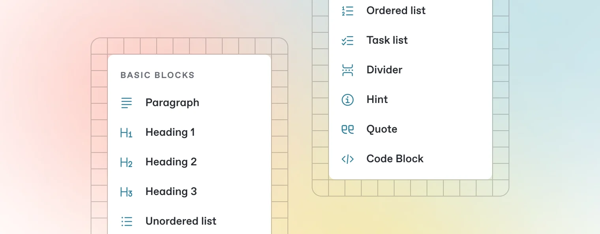

# page-1

## Page 1




## Heading One

hello world!

<code class="expression">space.vars.Fr</code>

<code class="expression">space.vars.ie</code>

### Heading 2

Hello World! Hi there!

| **one** | **two** | **three** |
| ------- | ------- | --------- |
| one.one | two.one | three.one |
| one.two | two.two | three.two |

```
print("hello world!")
```

* bullet point 1
* bullet point 2

> \[!INFO] This is some information

1. this is list item 1
2. this is list item 2
